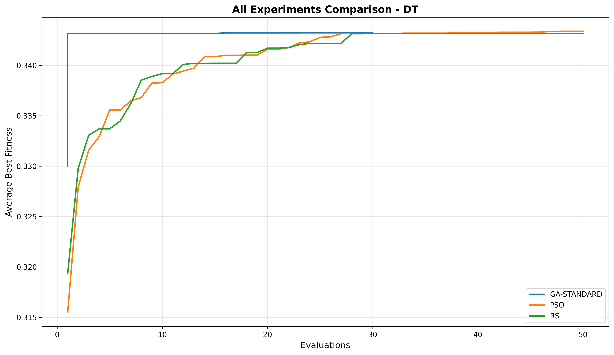
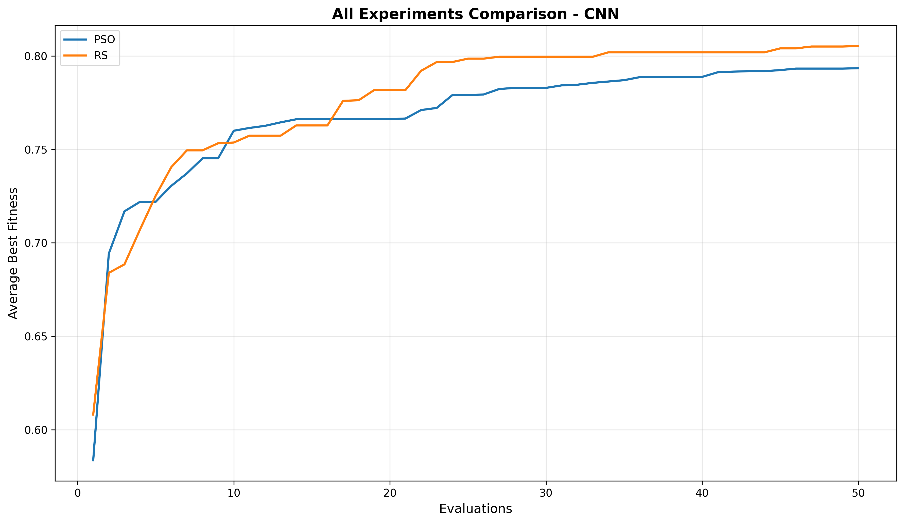
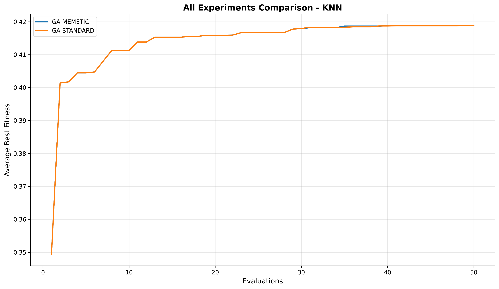
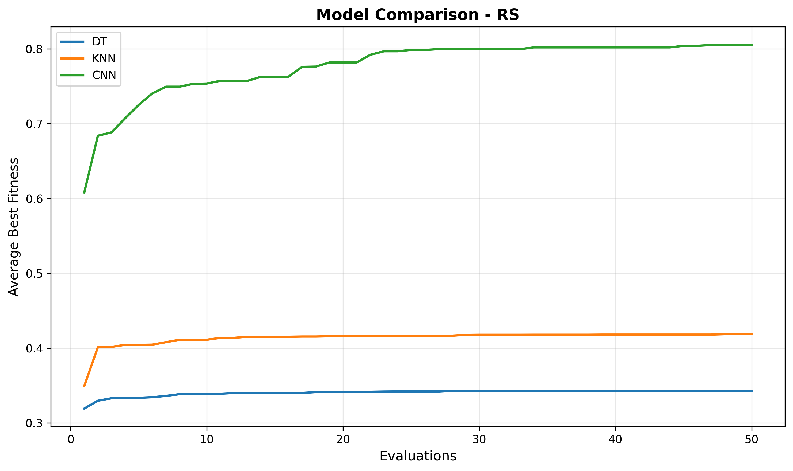
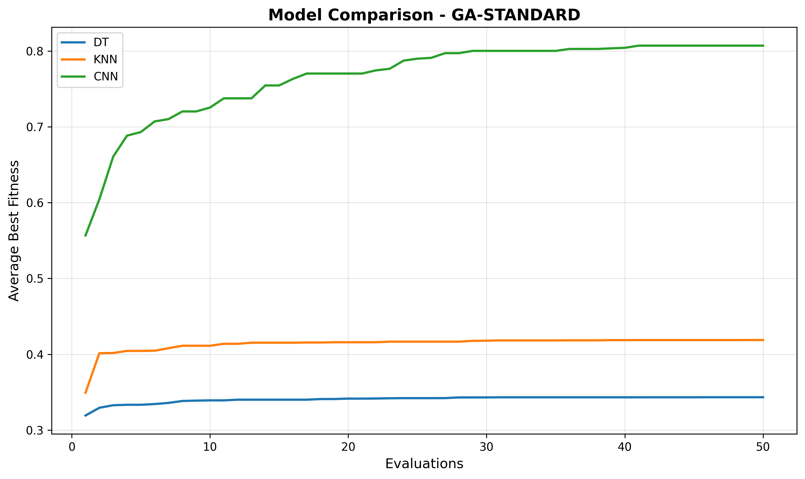
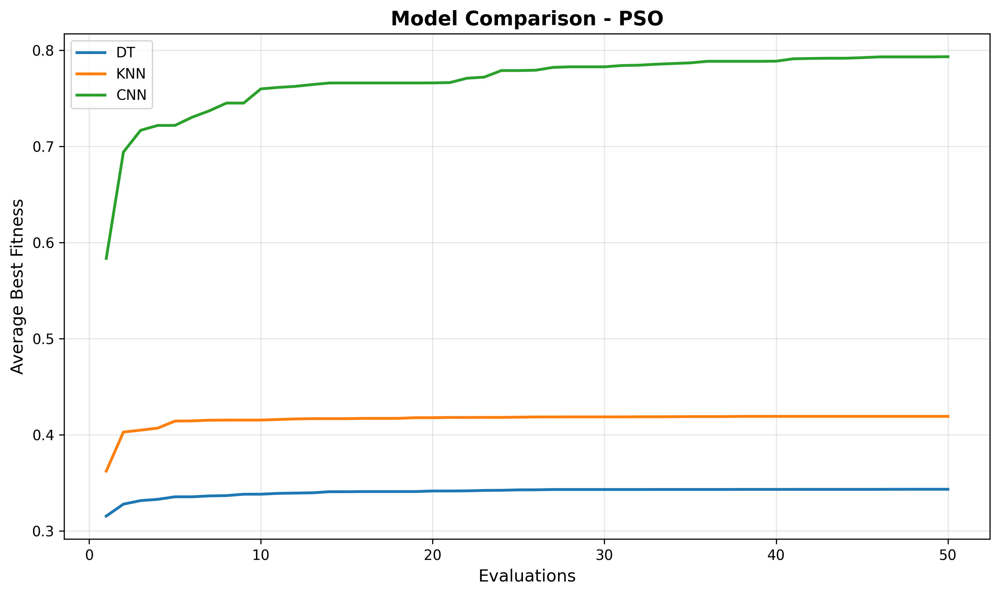

# Hyperparameter Tuning for Machine Learning Models
This project aims to explore and analyze metaheuristic search-based algorithms for different kinds of machine learning algorithms, in 2 different datasets. 

## Proposal
This is our [idea](./Project%20Proposal/Project%20Proposal%20-%20Fernando%20and%20Kelvin.pdf).

## Report
This is a [summary](./report/CSI5186_AI_Testing_Project_Report___Fernando__Kelvin.pdf) of our work with valid justifications.

## Datasets
* [CIFAR-10](https://www.cs.toronto.edu/~kriz/cifar.html)
    * Object Recognition
    * 32x32 Colored Images
    * In total 60000 images: 50000 training images and 10000 test images
    * 10 Balanced Classes

## Models in Consideration
* **Tree-based Model**: Decision Tree


* **(Pixels) Permutation-based** (especially, neural networks): Convolutional Neural Network (CNN)


* **Kernel-based**: K-Nearest-Neighbor (KNN)



## Metaheuristic Guided Search

### Baseline
* **Random Search** with a fixed and reproducible base seed across runs


### Other Algorithms
* **Evolutionary Algorithm**: 
   * Memetic Algorithm (a specialized Genetic Algorithm that escapes local search's plateau with one more tournament selection based on a `radius` parameter)
   * Standard Genetic Algorithm


* **Swarm Optimization**: Particle Swarm Optimization



## Prerequisites
- Python 3.9 or higher
- [uv](https://docs.astral.sh/uv/) package manager (recommended)

### Installation with uv (Recommended)

1. **Clone the repository**
   ```bash
   git clone <repository-url>
   cd Hyperparameter-Tuning-Search-Project
   ```

2. **Install dependencies** (this automatically creates a virtual environment)
   ```bash
   uv sync
   ```

3. **Run a quick demo**
   ```bash
   uv run python main.py
   ```

4. **Start Jupyter notebook**
   ```bash
   uv run jupyter notebook
   ```

### Alternative Installation with pip

1. **Create virtual environment**
   ```bash
   python -m venv venv
   source venv/bin/activate  # On Windows: venv\Scripts\activate
   ```

2. **Install dependencies**
   ```bash
   pip install -e .
   ```

## Execution Guide

### Complete Pipeline (Recommended)
Run the complete pipeline from data preparation through experiments to final training:

```bash
# Run all models with all optimizers
python main.py

# Run specific model with all optimizers
python main.py --model dt

# Run specific model with specific optimizer
python main.py --model cnn --optimizer rs

# Force re-download and re-process datasets
python main.py --force
```

**Available arguments:**
- `--model`: Model to run - `["dt", "knn", "cnn"]`. If omitted, runs all models.
- `--optimizer`: Optimizer to use - `["rs", "ga-standard", "ga-memetic", "pso"]`. If omitted, runs all optimizers for each model.
- `--force`: Force re-download and re-processing of datasets (default: False).

**Pipeline stages:**
1. **Data Download**: Automatically downloads CIFAR-10 dataset (if not present or with `--force`)
2. **Data Processing**: Processes and prepares datasets (if not present or with `--force`)
3. **Hyperparameter Search**: Runs experiments for specified model(s) and optimizer(s) combinations
4. **Final Training**: Trains models with best-found hyperparameters on full dataset and evaluates on test set

### Data Preparation (Manual)
If you prefer to run data preparation separately:

1. Run `data_download.py` to download the datasets needed. 
   * Note: Data are stored into the `.cache\` folder which is gitignored.
   * Note: Should you rerun the script again, and the folder already exists with contents, please run the script with argument `--force` to enable a smooth overwriting behavior. 
2. Run `data_process.py` to process the images in the datasets. 
3. Run `data_explorer.py` to view details of processed images from different API endpoints. 
   * Note: You may need to use a client such as Postman to launch those API requests. 
   * Note: Refer to [`openapi.yaml`](openapi.yaml) for more detailed descriptions of those endpoints. 
### Quick Model Training
You can quickly train a CNN model on CIFAR-10 using the provided training script:

```bash
# Basic training with default parameters (300 epochs)
python scripts/train_cnn.py

# Quick training with fewer epochs for testing
python scripts/train_cnn.py --epochs 10 --batch-size 64

# Custom training with specific hyperparameters
python scripts/train_cnn.py --epochs 50 --batch-size 128 --lr 0.001 --model-path .cache/models/my_cnn.pth
```

**Available arguments:**
- `--epochs`: Number of training epochs (default: 300)
- `--batch-size`: Batch size for training (default: 128)
- `--lr`: Learning rate (default: 0.0003)
- `--model-path`: Path to save the trained model (default: .cache/models/cnn_cifar.pth)
- `--device`: Force device selection (cuda/cpu, auto-detects if not specified)

The script includes:
- Automatic CIFAR-10 data loading and preprocessing
- TensorBoard logging for training visualization
- Early stopping and model checkpointing
- CUDA support with automatic device detection

### Model Training with a Customized Tuning Process
* A Proof-of-Concept end-to-end quick demo is shown in the Jupyter Notebook: `notebooks\rs_training.ipynb`. It focuses primarily on using a random solver (our choice of baseline) to search for the best set of hyperparameters based on a more updated version of classes and functions interfaces from our models. 

### Download Training Results
For the time being, we've prepared a zip folder, named `experiments.bak.zip`. You can load each subfolder inside `experiment`, into your git-ignored `.cache/experiment` directory, in the format of `<model>-<optimizer name>` as the folder name, with all the run folders captured by tensorboard inside. You need to also copy the entire `final_training` folder right under `.cache/`. Then you are good to run `analyze_experiment.py` or `experiment_analysis.ipynb` to visualize results of different searches on different models.

### Run a Search quickly
* You can run a quick hyperparameter search based on this script: 
```bash
python hparam_search.py
```
**Available arguments:**
- `--model`: Model Choices - `["dt", "knn", "cnn"]`, default `dt`.
- `--trials`: Number of Evaluations - default 5

* It is designed for quick, simple hyperparameter optimization only with our baseline (random search), mainly for exploratory runs or TensorBoard logging.
* It supports `dt`, `knn`, and `cnn` model options, via script arguments, but the CNN training is simpler (no explicit config object, no patience/early stopping control).
* It passes parameters directly to model creation/training; and so, it'll be less flexible for advanced training configs (e.g., custom epochs, patience).
* It is intended for quick experiments, visualizations, and debugging with a single optimizer.

### Run a Full Experiment (Advanced)
If you want more control over the experiment parameters, you can run experiments directly using this script: 
```bash
python scripts/run_experiment.py --model dt
```
**Available arguments:**
- `--model`: Model Choices - `["dt", "knn", "cnn"]`. **Mandatory** argument!!!
- `--optimizer`: Optimizer to use - `["rs", "ga-standard", "ga-memetic", "pso"]`. If omitted, runs all optimizers.
- `--runs`: Number of independent runs - default 1.
- `--evaluations`: Number of fitness evaluations per run - default 50.
- `--seed`: Base seed for randomization - default 42.
- `--n-jobs`: Number of parallel workers - default 1 for a sequential run. Use -1 for all CPUs.

* It is designed for systematic, reproducible experiments across all kinds of optimizers.
* All optimizers are supported and selectable via CLI.
* It saves results, convergence traces, and summaries to disk for later analysis (but not on TensorBoard).
* For CNN, it uses a TrainingConfig object for fine-grained control (learning rate, weight decay, optimizer, batch size, patience); and disables early stopping for CNN by default for fair comparison.
* Given its flexibility and robustness, it is intended for benchmarking, comparison, and research—especially when comparing optimizer performance.

### Run Final Training (Advanced)
After running experiments, you can run final training separately:
```bash
python scripts/run_final_training.py
```
**Available arguments:**
- `--seed`: Seed for final training runs - default 42.
- `--experiments`: Optional list of experiment names (e.g., `dt-rs`, `cnn-ga-standard`) to include. If omitted, trains all experiments found in `.cache/experiment/`.
- `--max-parallel-cnn`: Maximum parallel CNN trainings - default 1.
- `--max-parallel-classic`: Maximum parallel DT/KNN trainings - default 1.

This script:
- Loads best hyperparameters from each experiment's best run
- Trains models on the full training set
- Evaluates on the held-out test set
- Saves trained models and results to `.cache/final_training/`

### Analyze Results
Upon completion of an execution from the `run_experiment.py` script, you will likely get some folders under `.cache/experiment` folder. You can visualize plots for analysis based on this script: 
```bash
python scripts/analyze_experiment.py`
```
**Available arguments:**
- `--experiment`: Name of Experiment - `['cnn-rs', 'dt-ga', 'knn-pso']`
- `--diagnose-pso`: Whether it runs diagnostics for PSO search.

#### Supported Plots
* Plateau Detection
* Convergence Per Run
* Convergence Comparison. (Note: If you want to recompile this graph of the exact same pair of experiment, please delete the file from `.cache/experiment_figures/` folder, because the script tries to avoid generating repeated graphs.)
* Best Fitness over Evaluations with mean and std.
* Total Time Across Runs.
* Final Fitness Values Across Runs.
* Run this command with tensorboard to inspect GPU usages of specific runs: `tensorboard --logdir .cache/tensorboard/[specific folder]`. 
   * Note: this would require an extra dependency, by installing with: `pip install tensorflow`.
* Final Fitness Box Plot 

#### Analysis Specific to PSO
The `scripts/analyze_experiments.py` script tries to print diagnostics of the particle swarm optimization per run with advice.

#### Analysis Specific to GA
You can also run the following script to run and visualize experiments in a scripted pipeline:
```bash
python scripts/analyze_ga.py
```
The above-mentioned script is only running 1 experiment followed by an analysis (with graphs plotting) in a **sequential** manner. If you prefer running with parallel processing, please run the following pipeline (but please note that you will likely wait for all the experiments to complete before getting models and plots persisted on disk). You can run the pipeline alternatively with the following command:
```bash
python scripts/analyze_ga_parallel_run.py
```
They run with a single-job operation anyways (`--n-jobs = 1`).

#### Specific Analysis in General
A detailed analysis is shown in the Jupyter Notebook: `notebooks\experiment_analysis.ipynb`. It focuses primarily on 3 things:
* **Mean Final Fitness** of Runs per model-optimizer combination
* **Final Fitness Distribution** Box Plot
* **Final Training** Results, in terms of composite fitness.
* A **Comparison Plot** of fitnesses across optimizers under a certain model
* **Convergence Plots** per model
* Wilcoxon  **Statistical Test** (significance level = 0.05)